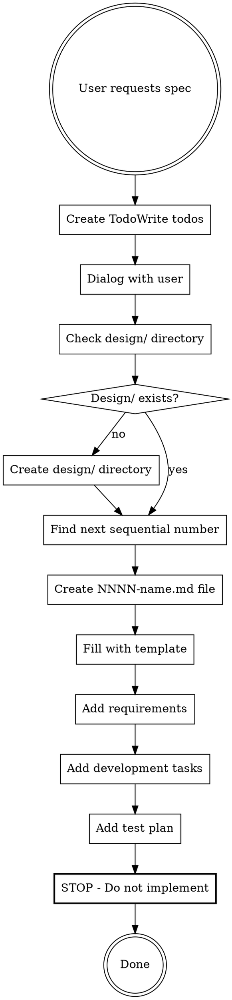

# Writing Feature Specifications

Create lightweight, actionable feature specifications using interactive dialog
and a standardized template.

## When to Use

Use this skill when the user requests:

- "Create a feature spec for..."
- "Write a feature specification for..."
- "I need a spec for..."

**Do NOT use for:**

- Implementation tasks (use other skills)
- Bug fixes or refactoring
- General documentation

## Core Principle

Feature specifications define WHAT to build (not HOW). Keep them simple,
specific, and testable. Engage in dialog to understand requirements before
writing.

## The Workflow



## Required Steps Checklist

**CRITICAL:** Use TodoWrite to track these steps:

- [ ] Engage in dialog with user to develop title, summary, and detailed
  description
- [ ] Check if design/ directory exists; create it if missing
- [ ] Scan design/ directory to find next sequential 4-digit number
  (start at 0001 if empty)
- [ ] Create file: design/NNNN-short-name.md
  (e.g., design/0001-dark-mode.md, design/0002-auth.md)
- [ ] Fill file with the template below (EXACTLY as shown, no extra sections)
- [ ] Decompose description into specific, testable requirements (numbered list)
- [ ] Decompose into simple development tasks (checklist format)
- [ ] Create test plan covering all requirements
  (reference requirements by number)

## The Template

**Use this EXACT template. Do not add, remove, or modify sections.**

Adding sections like "Rollout Plan", "Metrics", "Timeline", "Implementation
Details", etc. violates the spec format. If you add extra sections, you must
delete them and start over.

```markdown
# {feature title}

{short summary of the feature (1-2 sentences)}

## Description

{detailed description including:
- The trigger or situation for when this feature would be used
- The ability or artifact that is desired
- The value or outcome that is expected}

## Requirements

1. {First specific, testable requirement}
2. {Second specific, testable requirement}
3. {Etc.}

## Development tasks

- [ ] {First development task}
- [ ] {Second development task}
- [ ] {Etc.}

## Test plan

- {Description of automated test for requirement 1}
- {Description of automated test for requirement 2}
- {Etc.}
```

## Common Mistakes

| Mistake | Fix |
| ------- | --- |
| Creating file in repo root | Always create in design/ directory |
| Using random or descriptive filename | Use NNNN-short-name.md format |
| Over-engineering the spec | Use ONLY the template sections shown above |
| Adding rollout plans, metrics, etc. | STOP. Those aren't part of the spec. |
| Skipping interactive dialog | Always ask clarifying questions first |
| Offering "generic template" | Never offer shortcuts; always do proper dialog |
| Copying format from existing files | Use the template above, not other files |
| Implementing the feature | STOP at specification. Do not write code. |

## Red Flags - STOP

These thoughts mean you're about to violate the workflow:

- "I'll create a comprehensive spec" → Use simple template only
- "Let me use the existing spec format" → Use template above
- "I'll create a generic template" → Do proper dialog first
- "This needs rollout/metrics sections" → No, it doesn't
- "Now let me implement this" → STOP. Spec only.
- "I'll skip TodoWrite for this simple task" → TodoWrite is REQUIRED
- "I'll just add one more section" → NO. Use EXACT template only.

## File Naming Examples

**Correct:**

- `design/0001-dark-mode.md`
- `design/0002-user-authentication.md`
- `design/0023-api-rate-limiting.md`

**Incorrect:**

- `DARK_MODE_FEATURE_SPEC.md` (wrong location, wrong format)
- `design/dark-mode-spec.md` (missing number)
- `design/feature-1.md` (non-descriptive name)

## Dialog Questions

When requirements are vague, ask:

- What triggers the need for this feature?
- What specific ability or artifact is needed?
- What outcome or value is expected?
- Are there any constraints or edge cases?
- What would make this feature successful?

## After Creating the Spec

**STOP.** Do not:

- Implement the feature
- Write code
- Create rollout plans
- Add monitoring/metrics
- Start development tasks
- Offer to "get started on implementation"
- Ask "should I begin coding?"

**The output of this skill is ONLY the specification file.**

If the user asks you to implement the feature, that's a separate task. Use
appropriate implementation skills for that.
