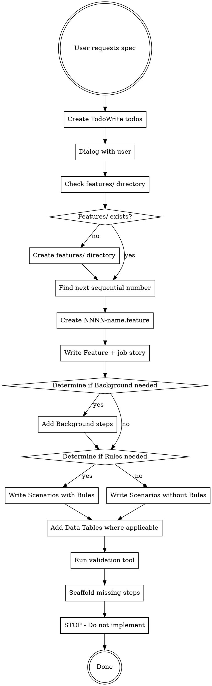

# Writing BDD Feature Specifications

Create executable feature specifications using Gherkin syntax, job stories, and
interactive dialog. These specifications are compatible with Cucumber, Behave,
SpecFlow, and other BDD tools.

## When to Use

Use this skill when the user requests:

- "Create a feature spec for..."
- "Write a feature specification for..."
- "I need a spec for..."
- "Create a BDD feature for..."

**Do NOT use for:**

- Implementation tasks (use other skills)
- Bug fixes or refactoring
- General documentation

## Core Principle

Feature specifications define WHAT to build through concrete examples using
Gherkin syntax. Keep scenarios simple, specific, and executable. Engage in
dialog to understand requirements before writing.

## The Workflow



## Required Steps Checklist

**CRITICAL:** Use TodoWrite to track these steps:

- [ ] Engage in dialog with user to develop job story (situation/action/outcome)
- [ ] Clarify key scenarios and edge cases
- [ ] Check if features/ directory exists; create it if missing
- [ ] Scan features/ directory to find next sequential 4-digit number
  (start at 0001 if empty)
- [ ] Create file: features/NNNN-short-name.feature
  (e.g., features/0001-dark-mode.feature, features/0002-shopping-cart.feature)
- [ ] Write Feature with job story description
- [ ] Determine if Background is needed (common setup across scenarios)
- [ ] Determine if Rules are needed (multiple business rules, each with
  2+ scenarios)
- [ ] Write concrete scenarios with Given/When/Then steps
- [ ] Use Data Tables for lists and complex data
- [ ] Keep scenarios simple (3-7 steps) and focused on behavior
- [ ] Ensure all scenarios are independently executable
- [ ] Identify the correct validation tool based on project language:
  - TypeScript/JavaScript: `yarn test:bdd --dry-run`
  - Python: `uvx behave -d`
  - Other: Follow project convention
- [ ] Run the tool to check for undefined steps
- [ ] Scaffold ANY undefined steps found:
  - Create a NEW file for EACH step in `features/steps/` with correct extension
    (e.g., `features/steps/step_user_logs_in.py` or `.ts`)
  - Use appropriate pending syntax for the body (e.g., `return 'pending'` or
    `raise StepNotImplementedError`)
  - Ensure validation command passes successfully

## The Template

**Use this Gherkin template. This is pure BDD - scenarios ARE the
specification.**

```gherkin
Feature: {Feature Title}
  When {situation}
  I want {action}
  So that {outcome/value}

  Background:
    {Optional: Common setup steps for all scenarios}
    Given {common context}

  Rule: {Optional: Business rule name}
    {Optional: Use when feature has multiple distinct business rules}

    Scenario: {Concrete example name}
      Given {initial context}
      And {additional context if needed}
      When {event or action}
      Then {expected outcome}
      And {additional expectation if needed}

    Scenario: {Another example for this rule}
      Given {context}
      When {action}
      Then {outcome}

  Scenario: {Scenario not under a specific rule}
    Given {context}
    When {action}
    Then {outcome}
```

## Template Examples

### Simple Example (No Background or Rules)

```gherkin
Feature: Dark mode toggle
  When working in low-light environments
  I want to switch the interface to dark mode
  So that I reduce eye strain and improve readability

  Scenario: User enables dark mode
    Given I am logged into the application
    And the interface is in light mode
    When I toggle the dark mode switch
    Then the interface should display with dark colors
    And my preference should be saved

  Scenario: Dark mode persists across sessions
    Given I have previously enabled dark mode
    When I log in to the application
    Then the interface should display in dark mode

  Scenario: User disables dark mode
    Given the interface is in dark mode
    When I toggle the dark mode switch
    Then the interface should display with light colors
    And my preference should be saved
```

### Complex Example (With Background, Rules, and Data Tables)

```gherkin
Feature: Shopping cart management
  When browsing products online
  I want to add items to a shopping cart
  So that I can purchase multiple items in a single transaction

  Background:
    Given I am logged into the e-commerce site
    And the product catalog is available

  Rule: Items can be added to cart

    Scenario: Add a single item to empty cart
      Given my cart is empty
      When I add "Wireless Mouse" to my cart
      Then my cart should contain 1 item
      And the cart total should be $29.99

    Scenario: Add multiple quantities of same item
      Given my cart is empty
      When I add 3 "USB Cable" items to my cart
      Then my cart should contain 3 items
      And the cart total should be $44.97

  Rule: Cart persists across sessions

    Scenario: Cart contents preserved after logout
      Given I have 2 items in my cart
      When I log out and log back in
      Then my cart should still contain 2 items

    Scenario: Cart cleared after purchase
      Given I have completed a purchase
      When I view my cart
      Then my cart should be empty

  Scenario: Remove item from cart
    Given my cart contains the following items:
      | Product        | Quantity | Price  |
      | Wireless Mouse | 1        | $29.99 |
      | USB Cable      | 2        | $14.99 |
    When I remove "USB Cable" from my cart
    Then my cart should contain 1 item
    And the cart total should be $29.99
```

## Gherkin Best Practices

### Background Usage

- Use `Background` to reduce repetition across scenarios
- Keep Background steps minimal (2-4 steps maximum)
- Only include context that applies to ALL scenarios
- If some scenarios need different setup, use Rule-level Backgrounds

### Rule Usage

- Only use `Rule` when a feature has multiple distinct business rules
- Each Rule must contain at least 2 Scenarios
- Rules help organize complex features with many scenarios
- Don't overuse - simple features don't need Rules

### Scenario Guidelines

- Keep scenarios simple (3-7 steps ideal)
- Focus on observable behavior, not implementation
- Use concrete examples with real data (not "User A" or "Product 1")
- Each scenario should be independently executable
- Scenario names should describe the specific example, not be generic

### Data Tables

- Use Data Tables for lists of similar data
- Excellent for testing multiple inputs/outputs
- Makes scenarios more readable than multiple And steps
- Examples: user lists, product catalogs, configuration options

Example:

```gherkin
Given the following users exist:
  | name   | email              | role  |
  | Alice  | alice@example.com  | admin |
  | Bob    | bob@example.com    | user  |
```

### Doc Strings

- Use for large text blocks (JSON, XML, markdown, etc.)
- Specify content type after opening delimiter for better tooling
- Delimit with `"""` or ` ``` `

Example:

```gherkin
Given I send the following JSON request:
  """json
  {
    "username": "alice",
    "password": "secret123"  // pragma: allowlist secret
  }
  """
```

## Common Mistakes

| Mistake | Fix |
| ------- | --- |
| Creating file in repo root | Always create in features/ directory |
| Using wrong filename format | Use NNNN-short-name.feature format |
| Using markdown format | Use Gherkin syntax (.feature files) |
| Writing implementation details | Focus on observable behavior only |
| Using Rule with only 1 scenario | Rules need at least 2 scenarios |
| Overly complex scenarios (15+ steps) | Break into multiple scenarios |
| Generic scenario names ("Test 1") | Use descriptive names ("User enables dark mode") |
| Repeating setup across scenarios | Use Background for common setup |
| Not using Data Tables for lists | Use tables for clearer, more maintainable specs |
| Vague or abstract examples | Use concrete data ("Alice", not "User A") |
| Skipping interactive dialog | Always ask clarifying questions first |
| Implementing the feature | STOP at specification. Do not write code. |

## Red Flags - STOP

These thoughts mean you're about to violate the workflow:

- "I'll create a comprehensive spec" → Keep it simple, focused on behavior
- "Let me add requirements/tasks sections" → Pure Gherkin only
- "I'll skip the dialog" → Always engage with user first
- "This scenario needs 20 steps" → Break into multiple scenarios
- "I'll use Rule for this single scenario" → Rules need 2+ scenarios
- "Now let me implement this" → STOP. Spec only.
- "I'll skip TodoWrite" → TodoWrite is REQUIRED
- "I'll add markdown sections" → NO. Pure Gherkin .feature files only.

## File Naming Examples

**Correct:**

- `features/0001-dark-mode.feature`
- `features/0002-user-authentication.feature`
- `features/0023-shopping-cart.feature`

**Incorrect:**

- `dark-mode.feature` (wrong location)
- `features/dark-mode-spec.feature` (missing number)
- `features/0001_dark_mode.feature` (underscore instead of dash)
- `features/0001-dark-mode.md` (wrong extension)

## Dialog Questions

When requirements are vague, ask:

**For Job Story:**

- What situation triggers the need for this feature?
- What specific action or capability is needed?
- What outcome or value does the user expect?

**For Scenarios:**

- What are the main ways this feature will be used?
- What edge cases should we consider?
- What should happen when things go wrong?
- Are there different user roles or contexts to consider?
- What data variations are important to test?

## After Creating the Spec

**STOP.** Do not:

- Implement the feature **logic** (keep steps as pending/not implemented)
- Write application code
- Start development tasks
- Offer to "get started on implementation"
- Ask "should I begin coding?"

**The output of this skill is the .feature file AND the scaffolded step
definitions.**

If the user asks you to implement the feature logic, that's a separate task. Use
appropriate implementation skills for that.
